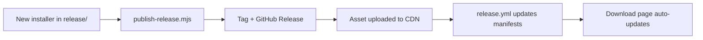

# ANXHIFY 🎧

> Your music, clipped on. — Official releases & documentation.

ANXHIFY is a free, premium music platform: YouTube search, Last.fm radio,
local files, podcasts, live "Listen Together" rooms and a global player —
with per-account sync, chat, and an anchor-language recommendation engine.

This repository is the **official distribution channel**: every production
build is published here as a GitHub Release (never in Git history), and the
download page at [anxhify.anxhora.shop/download](https://anxhify.anxhora.shop/download)
reads from this repo automatically.

---

## ⬇️ Download

| Platform | Latest | Size | Link |
|---|---|---|---|
| Windows (7+) | v1.0.0 | ~185 MB | [ANXHIFY-Setup-1.0.0.exe](https://github.com/ANXHORA/anxhify-releases/releases/download/v1.0.0/ANXHIFY-Setup-1.0.0.exe) |
| Android (11+) | v1.0.1 | ~7.6 MB | [anxhify-1.0.1.apk](https://github.com/ANXHORA/anxhify-releases/releases/download/v1.0.0/anxhify-1.0.1.apk) |
| Web | always latest | — | [anxhify.anxhora.shop](https://anxhify.anxhora.shop) |

> **SHA-256 (Windows v1.0.0):** `37D455BAE3313C39E5C88E061513B466D996F186B6F32DCC9A363286C230A14B`
> **SHA-256 (Android v1.0.1):** `1BDA14B32896D26C435D89F1B488D80C4F17FB19E7FDC9A8EB0ACB5610815E7B`

---

## ✨ What is ANXHIFY?

- **Search everything** — instant YouTube search with official-artist
  prioritization, artist / album / playlist / people search.
- **One language, always** — the recommendation engine locks to the language
  of the song you're playing (Punjabi stays Punjabi; phonk never bleeds in),
  then widens to same-genre, same-mood, your taste, history, followed
  artists and popular verified releases — with no artist loops.
- **Radio & discovery** — Last.fm-scoped radio, mood mixes, daily mixes.
- **Local files** — import folders, play offline, virtualized libraries.
- **Listen Together** — create a room, friends join with a code, playback,
  queue and chat stay in sync (Supabase Realtime, relay-verified).
- **Global player** — mini player, Dynamic Island capsule, sleep timer,
  crossfade/gapless, EQ, media keys, tray, remote control between devices.
- **Accounts that mean it** — per-account data on every device, Supabase
  auth (Google or email), playlists/favorites/follows/history synced,
  friend system + direct messages with realtime delivery.
- **Private by design** — RLS everywhere; account A can never read
  account B's data (verified by automated isolation suites).
- **Notifications everywhere** — OS notifications for DMs, friend activity
  and room alerts on desktop, PWA, browser and the Android app.

## 🚀 Installation

**Windows**: download the .exe, run it (SmartScreen: *More info → Run anyway*
— the binary is unsigned; the SHA-256 above verifies authenticity), sign in
with Google or email, and search your first song.

**Android (11+)**: download the .apk, allow "install unknown apps", install,
sign in, and allow notification permission when prompted.

## 📦 Release pipeline

Every release is published with:

- Installers live as **Release Assets only** — never in Git history.
- The download page reads this repo's latest release automatically.

## 📜 Changelog

### v1.0.0 — first public release (2026-08-30)
- **Playback engine hardened** — dual-client Innertube streams (ANDROID +
  WEB), anti-bot media validation, stale-request cancellation, timeouts.
- **Anchor language lock** — recommendations never mix languages/scenes.
- **Performance overhaul** — re-render storm eliminated, virtualized lists,
  lazy-loaded screens, memoized artwork.
- **Direct messages** — conversations, realtime delivery, typing indicator.
- **Jam rooms, playlists, radio, mini player, tray, media keys, remote
  control, per-account data isolation.**

### v1.0.1 — Android polish (2026-08-31)
- Android 11+ only (API 30): modern WebView, scoped storage, safe FGS.
- Full permission set (notifications, Bluetooth, overlay, media playback).
- Local notifications plugin — real DMs/alerts on Android.
- Signed release, versionCode 2, SHA-256 pinned.

## 🤝 Contributing / Support

Issues: open a ticket in this repository.
Web app source: [ANXHORA/ANXHIFY](https://github.com/ANXHORA/ANXHIFY).
